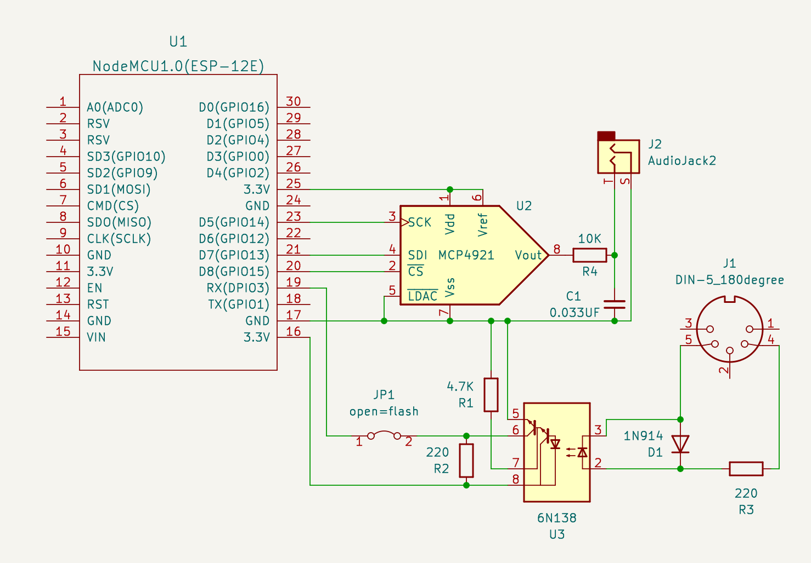

# Electuno. Vintage organ simulator

This project tries to simulate the sound of organs from the 60s/70s in small AVRs.

Specifications:
- Sound output through DAC MCP4921 (It is possible to operate it through PWM or other DACs).
- Controllable via MIDI (You need the MIDI library from the Arduino repositories).
- Fully modular to be able to disable functions on low-power CPUs.
- Simulates two independent keyboards (upper & lower) with nine drawbars each.
- Percussion effect on the upper keyboard.
- Independent vibrato chorus scanner effect for each keyboard.
- Delay effect to simulate a reverb.
- Overdrive effect.
- Two-way Leslie speaker with different speeds and accelerations.

It still has a lot of glitches and dirty noises, but it can be fun. 

**I have made it work on arduino Nano, Mega and Due; Although at the moment, i only have uploaded example files for nodeMCU-esp8266 with MCP4921 DAC and Arduino NANO328 with same DAC.**

**Only tested with Arduino IDE 1.8.19**

I hope little by little to add more example files and configurations (pwm in nano for example)

Arduino Nano Scheme

NodeMCU esp8266 Schemes

