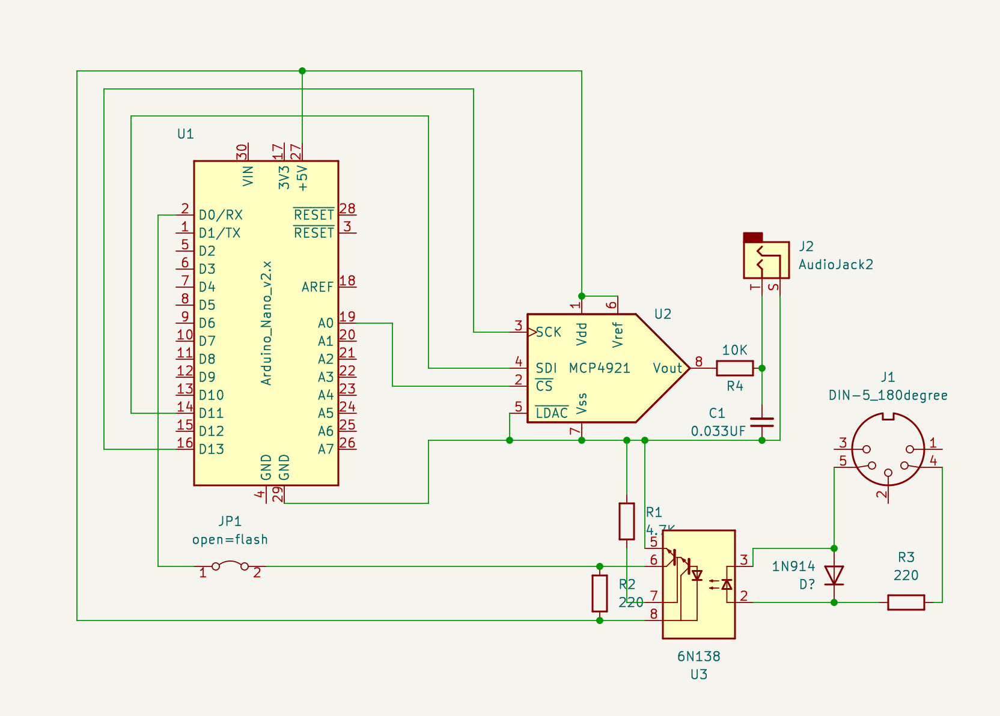

# Electuno 0.1.2. Vintage organ simulator

IMPORTANT:
This version is continually changing. There may be incomplete or non-working parts at times when I am testing. To use a version without this problem, I recommend installing the library directly from the Arduino IDE library manager.
You can also download an already generated release:
https://github.com/amiga68k/electuno/releases

**Requirements:**

coming soon

**Changes in this version:**
-  Fixed problem in accelerating the Leslie speaker simulation.
-  Added more MIDI controls (See list in this document below).
-  Added pedal keyboard.
-  Added independent volume controls for each keyboard.
-  Added support for expression pedal.
-  Added new LOWRAM method designed for Atmel328P and similar.
-  Added Arduino Due example test code.

**Presentation**

This project tries to simulate the vintage organs as Electone or Hammond, in small AVRs.

Demo video: https://youtu.be/f7KLLlDKEW8?si=Gs59R1dpGhj4l2iC

The code still needs a lot of work and organization; But it can be used on esp8266 boards with all the effects activated, two independent keyboards, and a polyphony of 16 simultaneous keys, at a frequency of approximately 22050Hz.

On a simple but effective ATMEL328 you can run two independent keyboards with vibrato/chorus, but the Leslie effect is very heavy.
Later I will try an Arduino DUE and an ESP32.

Specifications:
- Sound output through DAC MCP4921 (It is possible to operate it through PWM or other DACs).
- Controllable via MIDI (You need the MIDI library from the Arduino repositories).
- Fully modular to be able to disable functions on low-power CPUs.
- Simulates two independent keyboards (upper & lower) with nine drawbars each.
- Percussion effect on the upper keyboard.
- Independent vibrato chorus scanner effect for each keyboard.
- Delay effect to simulate a reverb.
- Overdrive effect.
- Two-way Leslie speaker with different speeds and accelerations.

It still has a lot of glitches and dirty noises, but it can be fun. 

I have made it work on arduino Nano, Mega and Due; Although at the moment, i only have uploaded example files for nodeMCU-esp8266 with MCP4921 DAC and Arduino NANO328 with same DAC.

Only tested with Arduino IDE 1.8.19.

I hope little by little to add more example files and configurations (pwm in nano for example)

**ES8266 notes**

First you must install support for this MCU in Arduino IDE: https://www.google.com/search?q=esp8266+on+arduino+ide.
Once support for Esp8266 is installed, you must install this library from the Arduino library manager;
Just search for 'electuno' and the available versions will appear.

Inside Arduino IDE, go to the menu 'file->examples->electuno->ESP8266xxxxxx'

**COMPILATION OPTIONS:**

**LOWRAM**

  Forces setting of main variables to 8 bits and select fixed 8 popyphony tonegenerator. Avaiable options:                
  Disable by default. No value is required, only write:
   - #define LOWRAM

**WAVEMIXMODE**

  Affects the volume of the drawbars in certain parts of the keyboard. Avaiable options:
 - 0 = All drawbars and tones have same volume.
 - 1 = Some tones have atenuation like analog organs. -Default-

**FREQTUNE**

  Used to multiply the base number by which the frequencies of musical notes are generated. Avaiable options:
 - x = Float number. 1 is for 44100Hz output frequency. 2 for 22050Hz... Etc.
 - 2 = For a 22050Hz output. -Default- 

**VOLUMECONTROL**

  Turns the independent upper/lower/pedal volume control on or off. Avaiable options:
 - 0 = Disable. -Default-
 - 1 = Enable.
 - 2 = Enable with fix for 8 bit microcontrollers as 328P.

**EXPRESSIONPEDAL**

  Set up the expression pedal. Avaiable options:
 - 0 = Disable. -Default-
 - 1 = Enable

**WAVESIZE**

  Configures the size in bits of the sine wave and the arrays that contain the mix samples.
  Theoretically, more is better, but it consumes more memory.Avaiable options:
 - 7 = 7 bits wave size ( Only tested from 7 to 12 ). -Default-
  
**POLYPHONY**

 - Configures the polyphony. Avaiable options:
 - 8 = 8 note polyphony of 16(max). -Default- 

**UPPERMODE**

  Defines the operation of the upper keyboard. Avaiable options:
 - 0 = Disable upper keyboard
 - 1 = Enable only flutes, without percusive harmonics -Default- 
 - 2 = Enable flutes and percusive keys harmonics

**LOWERMODE**

  Defines the operation of the lower keyboard. Avaiable options:
 - 0 = Disable lower keyboard. -Default-
 - 1 = Enable only fors  four flutes harmonics.
 - 2 = Enable all flutes harmonics.

**PEDALMODE**

  Defines the operation of the pedal bass keyboard. Avaiable options:
 - 0 = Disable bass pedal. -Default-
 - 1 = Enable with separated dry audio bus as Yamaha Electone style organs
 - 2 = Enable with upper/lower mixed audio bus. Overdrive, reverb and rotary affects in this mode

**CHORUS**

Defines the operation of the pedal bass keyboard. Avaiable options:
 - 0 = Disable chorus vibrato effect. -Default-
 - 1 = Enable with mixed bus for upper/lower
 - 2 = Enable with an independent audio bus for each keyboard

**CHORUSBUFFERSIZE**

Sets the buffer size for the chorus effect, in bits.
  ATTENTION: The size of the buffer for this effect directly affects the tuning of the vibrato effect;
  For this reason there is no real default value, as it depends on the output frequency. Avaiable options:
 - 4 = 16 steps vibrato effect. -Default-

**REVERB**

  Enable or disable reverb effect. Avaiable options:
 - 0 = Disable- -Default-
 - 1 = Enable reverb effect.

**OVERDRIVE**

  Enable or disable overdrive effect. Avaiable options:
 - 0 = Disable. -Default-
 - 1 = Enable overdrive effect.

**LESLIE**

  Sets the rotary effect on or off. Avaiable options:
 - 0 = Disable. -Default-
 - 1 = Enable but only one rotor simulation, same as spinet organs internal rotary speaker.
 - 2 = Enable with two bus of audio for drum/horn speakers, try to simulate external leslie cabinets.

**LESLIEBUFFERSIZE**

  Sets the buffer size for the rotary effect, in bits.
  ATTENTION: The size of the buffer for this effect directly affects the tuning of the rotary effect.
  Avaiable options:
 - 7 = 7 bit rotary effect buffer. -Default-

**Default MIDI configuration**

**Channel 1 (Upper & effects control):**
-  1   Reverb
-  3   Upper volume
-  11  Expression
-  50  Lower vibrato switch
-  51  Upper vibrato switch
-  54  Overdrive
-  55  Rotary off/slow/fast
-  56  Rotary drum vibrato amount
-  57  Rotary horn vibrato amount  
-  58  Rotary lowpass filter
-  59  Rotary hipass filter
-  80  Enable percusive keys
-  81  Percusive key harmonic (4' & 2'2/3)
-  82  Percusive key decay time (slow & fast )
-  70  Drawbar 16'
-  71  Drawbar 5'1/3
-  72  Drawbar 8'
-  73  Drawbar 4'
-  74  Drawbar 2'2/3
-  75  Drawbar 2'
-  76  Drawbar 1'3/5
-  77  Drawbar 1'1/3
-  78  Drawbar 1'

**Channel 2 (Lower):**
-  3   Lower volume
-  70  Drawbar 16'
-  71  Drawbar 5'1/3
-  72  Drawbar 8'
-  73  Drawbar 4'
-  74  Drawbar 2'2/3
-  75  Drawbar 2'
-  76  Drawbar 1'3/5
-  77  Drawbar 1'1/3
-  78  Drawbar 1'

**Channel 3 (Pedals):**
-  3   Pedal volume
-  70  Drawbar 16'
-  71  Drawbar 5'1/3
-  72  Drawbar 8'
-  73  Drawbar 4'
-  74  Drawbar 2'2/3
-  75  Drawbar 2'
-  76  Drawbar 1'3/5
-  77  Drawbar 1'1/3
-  78  Drawbar 1'

**Schematics**

R4 and C1 must be adjusted to achieve a suitable sound filter according to the output frequency.

For this I have seen the following website: https://www.learningaboutelectronics.com/Articles/Low-pass-filter-calculator.php

Arduino Nano Scheme

NodeMCU esp8266 Scheme

